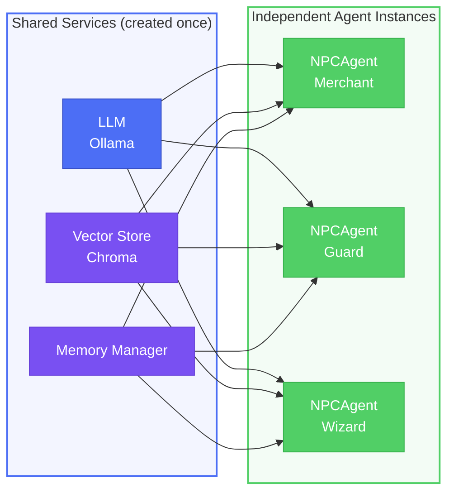
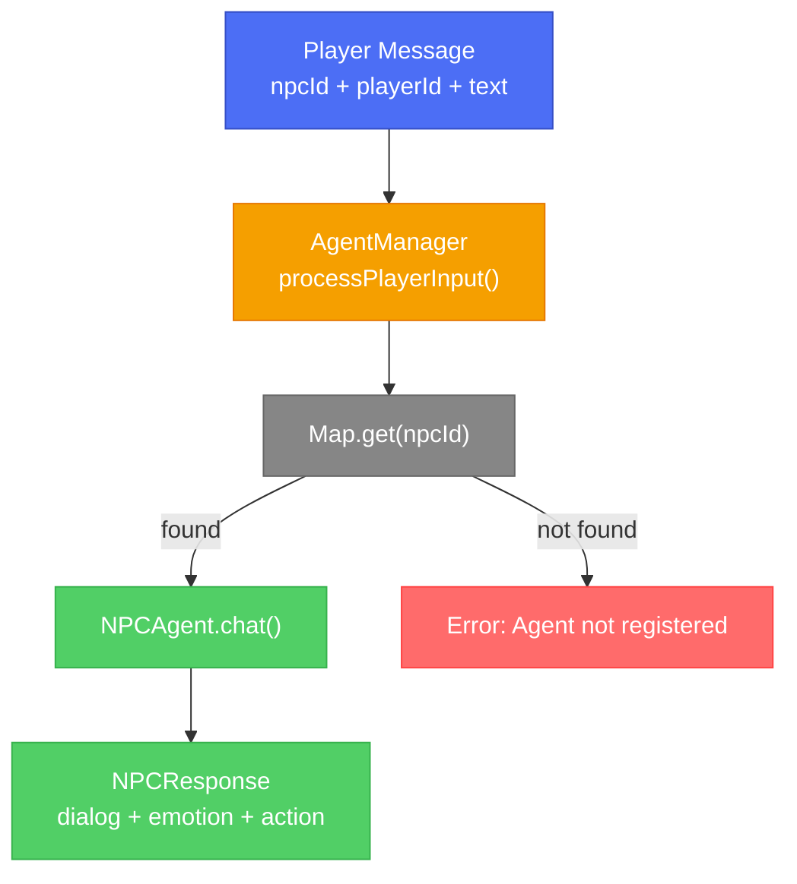
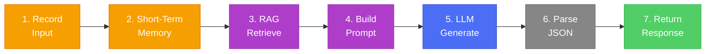
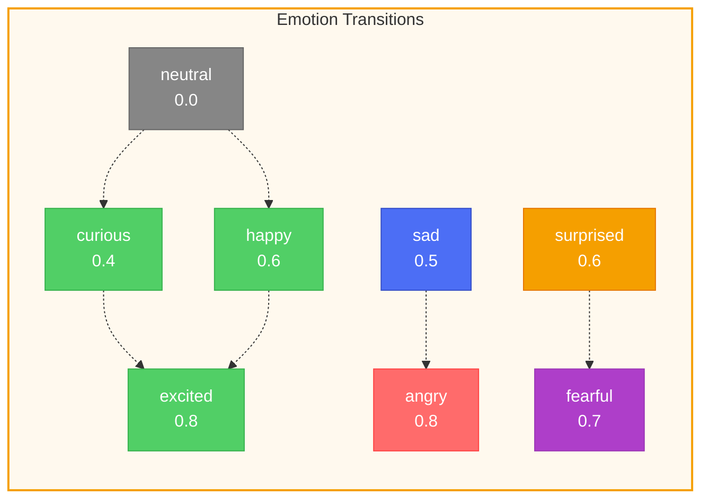
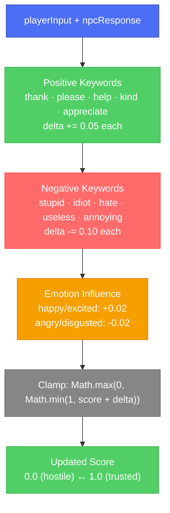

# Phase 8: Agent Framework - Pipeline Guide

**Understanding the NPC Agent Pipeline**

This document explains how the agent framework processes player interactions through the full pipeline.

---

## Table of Contents

- [Agent Architecture](#agent-architecture)
- [NPCAgent Class](#npcagent-class)
- [AgentManager Class](#agentmanager-class)
- [Chat Pipeline](#chat-pipeline)
- [State Management](#state-management)
- [Emotion Tracking](#emotion-tracking)
- [Relationship Scoring](#relationship-scoring)

---

## Agent Architecture

### Why Agents?

Previous phases built individual components:
- **Phase 2:** LLM for text generation
- **Phase 5:** Embeddings and vector store
- **Phase 6:** RAG for knowledge retrieval
- **Phase 7:** Memory for conversation history

The **Agent** combines all of these into a single, self-contained NPC that:
- Maintains its own state (emotion, relationships)
- Processes player input through the full pipeline
- Returns consistent, in-character responses

### Design Pattern: Composition

Each agent **contains** references to shared services rather than creating its own:

```typescript
// Shared services (created once)
const llm = createOllamaLLM();
const retriever = createKnowledgeRetriever(vectorStore, embeddings);
const memoryManager = new MemoryManager(...);

// Each agent uses the same services but has independent state
const merchant = new NPCAgent(merchantPersonality, llm, retriever, memoryManager);
const guard = new NPCAgent(guardPersonality, llm, retriever, memoryManager);
```

This pattern:
- Reduces resource usage (one LLM connection, one vector store)
- Allows independent agent state
- Makes agent creation lightweight



---

## NPCAgent Class

**File:** `src/agents/npcAgent.ts`

### Encapsulated State

Each NPCAgent instance maintains:

| Property | Type | Purpose |
|----------|------|---------|
| `personality` | NPCPersonality | Character traits, backstory, speech patterns |
| `conversationHistory` | ConversationContext[] | Recent dialog (capped at max) |
| `emotionState` | EmotionState | Current and previous emotion + intensity |
| `relationshipScore` | number (0.0-1.0) | Player-NPC relationship quality |

### Injected Services

| Service | Type | Purpose |
|---------|------|---------|
| `llm` | BaseChatModel | Text generation via Ollama |
| `retriever` | KnowledgeRetriever | RAG context retrieval |
| `memoryManager` | MemoryManager (optional) | Short/long-term memory storage |

---

## AgentManager Class

**File:** `src/agents/agentManager.ts`

### Registry Pattern

The AgentManager uses a `Map<string, NPCAgent>` to maintain a registry of active agents:

```
agents Map:
  "merchant_001" --> NPCAgent (Gregor the Merchant)
  "guard_002"    --> NPCAgent (Captain Stone)
  "wizard_003"   --> NPCAgent (Merlin the Wise)
```

### Factory Pattern

The `createAgent()` method:
1. Checks concurrent agent limit (default: 50)
2. Checks for duplicate agent IDs (returns existing if found)
3. Creates new NPCAgent with shared services
4. Registers in the Map
5. Returns the agent

### Message Routing

`processPlayerInput(npcId, playerId, message)` routes messages to the correct agent by looking up the NPC ID in the registry and calling `agent.chat()`.



---

## Chat Pipeline

The `chat()` method is the core processing pipeline:



### Step 1: Record Player Input
```typescript
const playerEntry: ConversationContext = {
  timestamp: new Date(),
  speaker: 'player',
  message: playerInput,
};
this.conversationHistory.push(playerEntry);
```

### Step 2: Store in Short-Term Memory
```typescript
if (this.memoryManager) {
  this.memoryManager.addToShortTerm(this.personality.id, playerId, playerEntry);
}
```

### Step 3: Retrieve RAG Context
```typescript
const context = await this.retriever.retrieveMultiSource(
  this.personality.id,
  playerInput,
  { personalityTopK: 2, loreTopK: 3, conversationTopK: 2 }
);
```

This retrieves:
- Personality-related documents (traits, backstory)
- Game lore (world knowledge)
- Past conversation context

### Step 4: Build Prompt
The prompt combines:
- System prompt from personality profile
- Retrieved RAG context
- Recent conversation history (last 6 messages)
- Current player input

### Step 5: Generate LLM Response
```typescript
const llmResponse = await this.llm.invoke(prompt);
const responseText = llmResponse.content.toString();
const response = this.parseResponse(responseText);
```

### Step 6: Update Agent State
- Update emotion based on response
- Update relationship score based on player keywords
- Add NPC response to conversation history
- Store in long-term memory

### Step 7: Return Response
```typescript
return {
  dialog: "Welcome, traveler! I have fine potions today.",
  emotion: "happy",
  action: { type: "open_inventory" }
};
```

---

## State Management

### Emotion State

```typescript
interface EmotionState {
  currentEmotion: EmotionType;    // e.g., 'happy', 'angry'
  emotionIntensity: number;       // 0.0 - 1.0
  previousEmotion: EmotionType;   // for transition tracking
  lastUpdate: Date;               // when emotion last changed
}
```

### Agent State Snapshot

`getState()` returns a read-only snapshot:

```typescript
{
  npcId: "merchant_001",
  name: "Gregor",
  currentEmotion: "happy",
  emotionIntensity: 0.6,
  relationshipScore: 0.55,
  conversationHistoryLength: 4,
  lastInteraction: "2024-01-15T10:30:00.000Z"
}
```

### Reset Behavior

`resetConversation()` clears:
- Conversation history (empty array)
- Emotion state (back to neutral)

It does **not** reset:
- Relationship score (persistent across conversations)
- Personality data (immutable)

---

## Emotion Tracking

### Intensity Mapping

Each emotion type has a default intensity:

| Emotion | Intensity |
|---------|-----------|
| neutral | 0.0 |
| curious | 0.4 |
| sad | 0.5 |
| disgusted | 0.5 |
| happy | 0.6 |
| surprised | 0.6 |
| fearful | 0.7 |
| angry | 0.8 |
| excited | 0.8 |

### Transition Tracking

The `previousEmotion` field enables:
- Detecting emotional shifts
- Smooth emotion transitions in animations
- Context for future responses



---

## Relationship Scoring

### Score Range: 0.0 (hostile) to 1.0 (trusted friend)

**Starting value:** 0.5 (neutral)

### Factors that Increase Score (+)

| Factor | Delta | Example |
|--------|-------|---------|
| Positive keywords | +0.05 each | "thank", "please", "help", "kind", "appreciate" |
| Happy/excited NPC emotion | +0.02 | NPC responds positively |

### Factors that Decrease Score (-)

| Factor | Delta | Example |
|--------|-------|---------|
| Negative keywords | -0.10 each | "stupid", "idiot", "hate", "useless", "annoying" |
| Angry/disgusted NPC emotion | -0.02 | NPC responds negatively |

### Clamping

```typescript
this.relationshipScore = Math.max(0, Math.min(1, this.relationshipScore + delta));
```

This ensures the score never goes below 0 or above 1.



---

## Complete Example

```typescript
// 1. Create shared services
const llm = createOllamaLLM();
const vectorStore = await createChromaVectorStore();
const embeddings = createEmbeddingGenerator();
const retriever = new KnowledgeRetriever(vectorStore, embeddings);
const memoryManager = new MemoryManager(vectorStore, embeddings, retriever, llm);

// 2. Create agent manager
const agentManager = createAgentManager(llm, retriever, memoryManager);

// 3. Load and create agents
const merchantPersonality = await loadPersonality('data/personalities/merchant_001.json');
const merchant = agentManager.createAgent(merchantPersonality);

// 4. Process player input
const response = await agentManager.processPlayerInput(
  'merchant_001',
  'player_123',
  'Hello! What do you have for sale?'
);

console.log(response);
// { dialog: "Welcome! I have potions, scrolls...", emotion: "happy", action: {...} }

// 5. Get agent state
const state = merchant.getState();
console.log(state);
// { npcId: "merchant_001", currentEmotion: "happy", relationshipScore: 0.52, ... }
```

---

*Phase 8 of 10 - Agent Framework*
