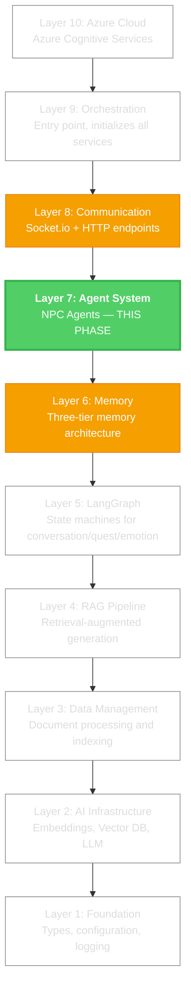
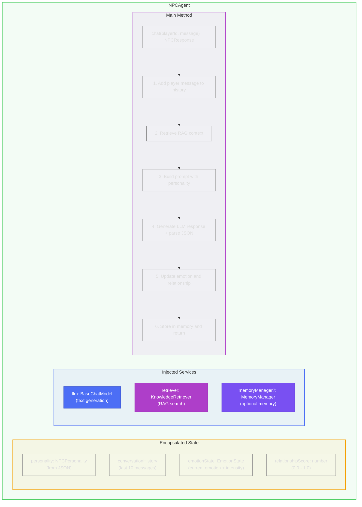
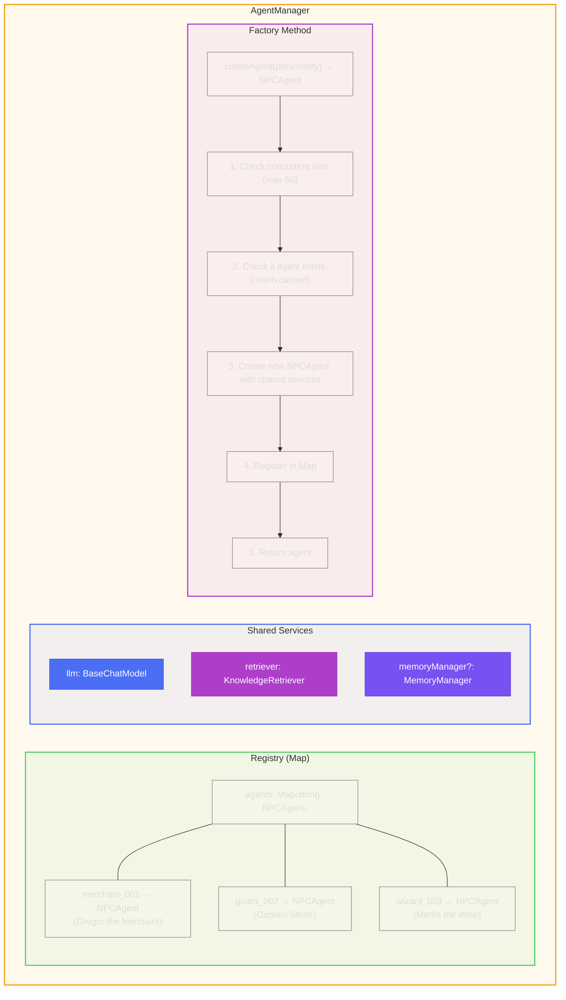
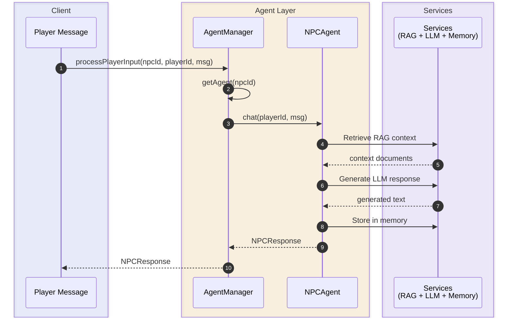
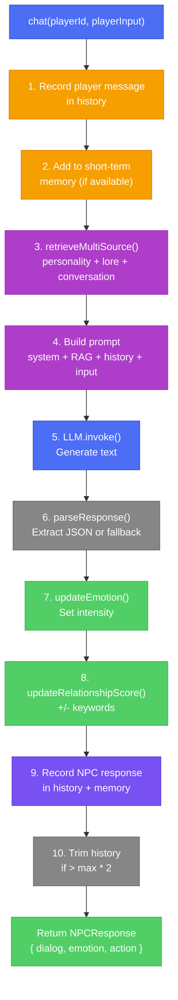
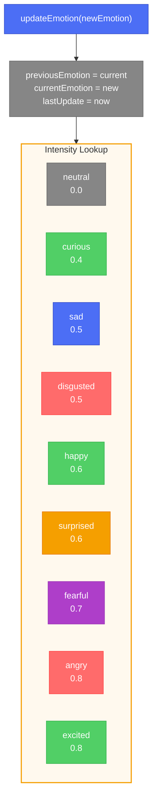
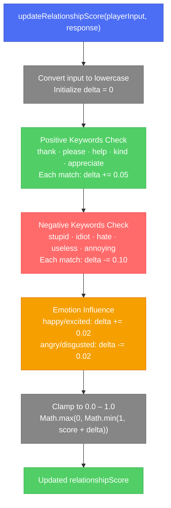

# Phase 8: Agent Framework - Visual Guide

**Architecture Diagrams and Flow Charts**

---

## Layer Position in Full Architecture

---

## NPCAgent Structure

---

## AgentManager Structure

---

## Request Flow Through Agent System

---

## Chat Method Pipeline (Detailed)

---

## Emotion State Transitions

---

## Relationship Score Flow

---

## Dependencies

**This phase uses all previous components:**

| Phase | Component | Used For |
|-------|-----------|----------|
| Phase 1 | Types, Config, Logger | Core infrastructure |
| Phase 2 | OllamaLLM | Text generation |
| Phase 4 | Personality Loader | Character data |
| Phase 5 | Embeddings, VectorStore | Vector operations |
| Phase 6 | RAG Pipeline (Retriever) | Context retrieval |
| Phase 7 | Memory Manager | Conversation memory |

---

## Key Files

| File | Purpose |
|------|---------|
| `src/agents/npcAgent.ts` | Individual NPC agent class |
| `src/agents/agentManager.ts` | Agent registry and factory |
| `src/core/index.ts` | Type definitions (EmotionType, NPCResponse, etc.) |
| `src/index.ts` | Entry point demonstrating agent usage |

---

*Phase 8 of 10 - Agent Framework*
